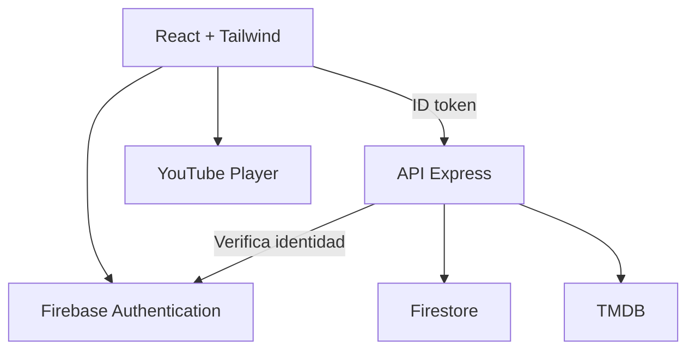

# 01 — Arquitectura y alcance

<!-- navigation:start -->

[← Anterior](./00-leeme.md) | [Índice del proyecto](./README.md) | [Siguiente →](./02-instalacion-monorepo.md)

[🏠 Índice general](../../README.md)

<!-- navigation:end -->

## Producto

CineFlow permite descubrir películas y series, consultar detalles, ver tráilers, guardar favoritos y retomar tráilers por perfil. Se inspira en la interacción de Netflix, con identidad gráfica propia. La interfaz dirá “Ver tráiler”, “Historial de tráilers” y “Continuar tráiler”, evitando sugerir que una reproducción representa una película completa.

## Arquitectura



Firebase Auth es el proveedor de identidad, Express el punto de autorización de datos propios y TMDB el proveedor de catálogo. El navegador puede descargar imágenes del CDN autorizado de TMDB y videos de YouTube, pero sus consultas de catálogo pasan por Express. El token TMDB y la cuenta de servicio pertenecen exclusivamente al servidor.

## Por qué un mini backend

Aunque Firebase permite acceso directo desde el navegador, aquí necesitamos centralizar autorización por cuenta, validar los datos, proteger TMDB y estabilizar los contratos. Una API pequeña con módulos por dominio cumple esas funciones sin microservicios, colas ni infraestructura innecesaria.

## Límites por componente

| Componente | Responsabilidad | No le corresponde |
|---|---|---|
| Web | Presentación, interacción, SDK Auth, estado de consultas | Confiar en uid enviado por formularios |
| API | Verificar token, pertenencia, reglas, TMDB y Firestore | Guardar contraseñas o alojar películas |
| Auth | Credenciales e identidad | Favoritos e historial |
| Firestore | Datos propios y orden de consultas | Descargar todo el catálogo |
| contracts | Esquemas Zod y DTO compartidos | Importar Firebase Admin o secretos |

Los controllers traducen HTTP; los services ejecutan reglas; los repositories encapsulan Firestore; el cliente TMDB adapta respuestas externas. Inyectar repositorios y cliente de catálogo permite pruebas sin Internet.

## Flujos y reglas de negocio

1. Visitante: puede consultar catálogo y detalles. Guardar favoritos requiere acceso.
2. Registro: SDK Auth crea identidad; PUT /me provisiona documento y perfil principal en transacción idempotente.
3. Acceso: esperar restauración de Auth, provisionar si hace falta, cargar perfiles y seleccionar uno.
4. Favorito: PUT identifica película o serie y no genera duplicados. DELETE elimina de forma idempotente.
5. Historial: únicamente aparece cuando empieza la reproducción; abrir la ficha no cuenta como reproducción.
6. Salida: SDK cierra sesión y la app vacía caché privada y perfil activo.
7. Cambiar perfil: cancelar consultas privadas anteriores y usar claves de caché que incluyan uid y profileId.

## Alcance v1 cerrado

Incluye email/password, recuperación de contraseña, verificación de email, perfil principal, hasta cinco perfiles, CRUD de perfiles, favoritos, historial con posición, filtros de catálogo, detalle, tráiler, preferencias de idioma y cierre global de sesiones. Las operaciones privadas requieren identidad válida; v1 no exige email verificado para favoritos, pero muestra su estado y permite reenviar verificación.

No incluye panel de administración, roles de docente, pagos, recomendaciones por IA, PIN infantil, descargas de videos, reseñas públicas ni sincronización en tiempo real. El borrado completo de cuenta queda fuera de v1; no publicar un botón que prometa hacerlo. Borrar un perfil sí incluye sus favoritos e historial.

## Estructura objetivo

```text
cineflow/
  apps/
    api/
      src/
        app.ts
        server.ts
        config/
        middleware/
        modules/{me,profiles,favorites,history,catalog}/
        integrations/tmdb/
        shared/
      tests/
      scripts/seed.ts
      openapi.yaml
      package.json
      tsconfig.json
      .env.example
    web/
      src/
        app/{router,providers}/
        components/
        features/{auth,profiles,catalog,favorites,history,player}/
        lib/
        styles/
        test/
      public/
      package.json
      .env.example
  packages/contracts/src/
  firebase/{firestore.rules,firestore.indexes.json}
  docs/
  firebase.json
  package.json
  package-lock.json
  .gitignore
  .nvmrc
```

Para esta escala no crear packages/ui: componentes en web; extraerlos solamente cuando exista un segundo consumidor real. En contracts exportar esquemas y tipos desde dist para Node ESM. El frontend consume la misma versión local mediante npm workspaces.

---

<!-- navigation:start -->

[← Anterior](./00-leeme.md) | [Índice del proyecto](./README.md) | [Siguiente →](./02-instalacion-monorepo.md)

[🏠 Índice general](../../README.md)

<!-- navigation:end -->
