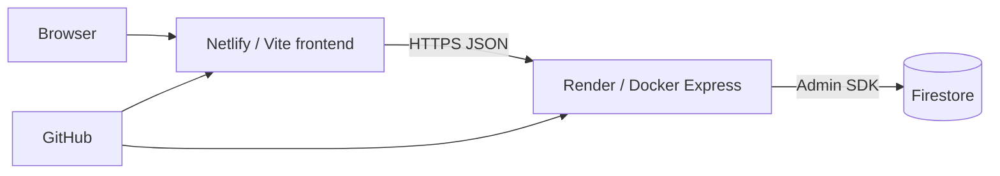

# Arquitectura

- `apps/web`: Vite, JS ES Modules, Tailwind 4; `VITE_API_URL` es pública y NO debe contener secretos.
- `apps/api`: Express, Zod, helmet, CORS, Firestore Admin SDK; `STORAGE_DRIVER=memory` local y `firestore` para nube.
- `compose.yaml`: un contenedor API con memoria efímera; al reiniciar se pierden datos. Se explica por qué contenedores no son bases de datos.
- Firebase: JSON de cuenta de servicio en **variable de entorno privada del servidor** `FIREBASE_SERVICE_ACCOUNT_JSON`; jamás en Git ni Netlify.
- Seguridad: sin login, operaciones compartidas; exclusivamente datos ficticios y demostración temporal. Para uso real añadir Firebase Auth, reglas de autorización backend, aislamiento por usuario, rate limiting y auditoría.
- El resumen usa enteros de centavos para evitar imprecisiones habituales de coma flotante.
- Firestore consulta hasta 200 documentos para limitar el tamaño del laboratorio; no representa paginación productiva.
